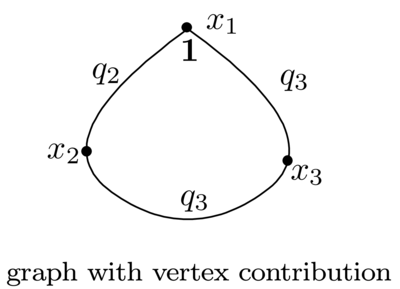
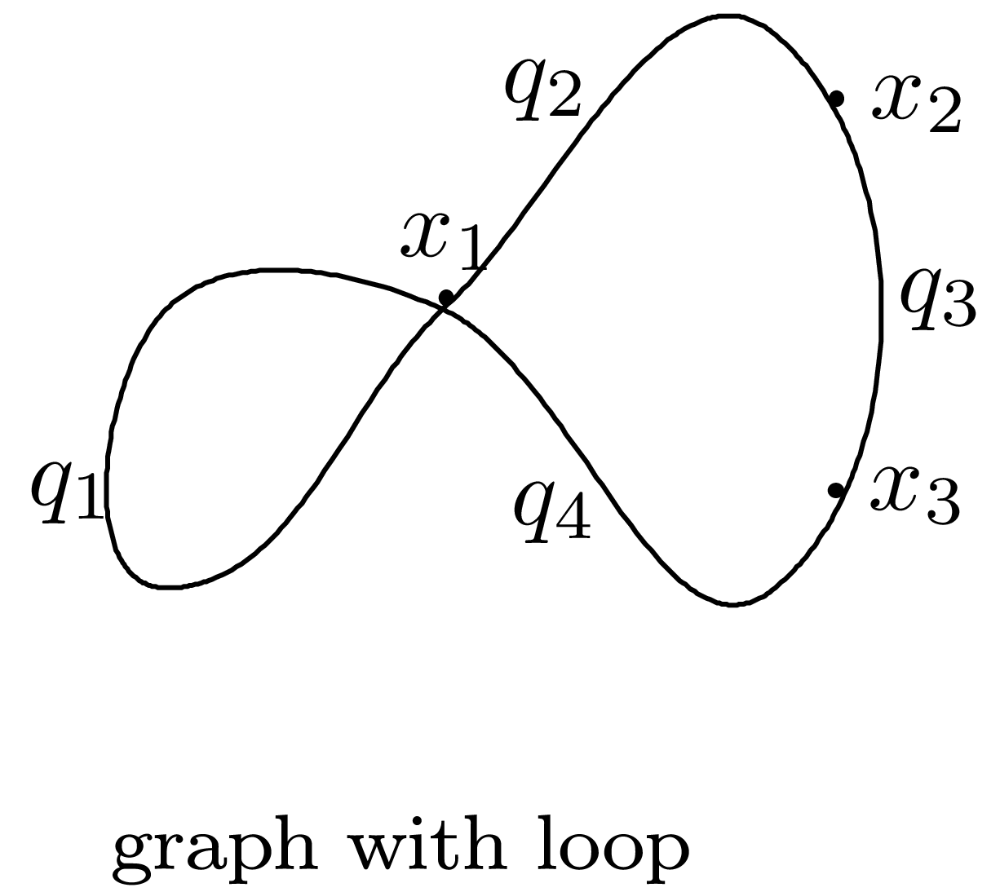

```@meta
CurrentModule = GromovWitten
```


```@autodocs
Modules = [GromovWitten]
```

# Examples Hurwitz numbers.


To provide an example on how to use our package, we define a graph G from a list of edges:

```julia
julia> G = graph([(1, 3), (1, 2), (1, 2), (2, 4), (3, 4), (3,4)] )
graph([(1, 3), (1, 2), (1, 2), (2, 4), (3, 4), (3, 4)])
```
We then define a polynomial ring with all variables required by our implementation:

```julia
julia> R, x, q = polynomial_ring(G, "x", "q")
(Multivariate polynomial ring in 10 variables over QQ, QQMPolyRingElem[x[1], x[2], x[3],x[4]], QQMPolyRingElem[q[1], q[2],q[3], q[4], q[5], q[6]])
```
Here, the indexed variables x correspond to the vertices of the graph, the indexed variables y to the edges of the graph, and the indexed variables z again to the vertices of the graph (the latter to be used in the context of Gromov-Witten invariants with non-trivial Psi-classes).

To compute a Feynman iuntegral, we define a partition  $a = [0, 2, 1, 0, 0, 1]$  of degree d=3, a fixed order of vertex $ o=[1,3,4,2. We have then

```julia
julia> a = [0, 2, 1, 0, 0, 1];
```

```julia
julia> o=[1,3,4,2];
```
The Feynman Integral branch type for a fixed ordering  is 

```julia

julia>  feynman_integral_branch_type_order(x,q,G,a,o) 
128*q[2]^4*q[3]^2*q[6]^2
```
The Feynman Integral branch type for all ordering  is

```julia
julia> feynman_integral_branch_type(x, q, G, a)  
256*q[2]^4*q[3]^2*q[6]^2
```
also we can compute Feynman Integral of degree 3
```julia
julia> f = feynman_integral_degree(x, q, G, 3)
288*q[1]^6 + 32*q[1]^4*q[2]^2 + 32*q[1]^4*q[3]^2 + 32*q[1]^4*q[5]^2 + 32*q[1]^4*q[6]^2 + 8*q[1]^2*q[2]^2*q[5]^2 + 8*q[1]^2*q[2]^2*q[6]^2 + 8*q[1]^2*q[3]^2*q[5]^2 + 8*q[1]^2*q[3]^2*q[6]^2 + 24*q[2]^6 + 152*q[2]^4*q[3]^2 + 8*q[2]^4*q[5]^2 + 8*q[2]^4*q[6]^2 + 152*q[2]^2*q[3]^4 + 32*q[2]^2*q[3]^2*q[5]^2 + 32*q[2]^2*q[3]^2*q[6]^2 + 32*q[2]^2*q[4]^4 + 8*q[2]^2*q[4]^2*q[5]^2 + 8*q[2]^2*q[4]^2*q[6]^2 + 8*q[2]^2*q[5]^4 + 32*q[2]^2*q[5]^2*q[6]^2 + 8*q[2]^2*q[6]^4 + 24*q[3]^6 + 8*q[3]^4*q[5]^2 + 8*q[3]^4*q[6]^2 + 32*q[3]^2*q[4]^4 + 8*q[3]^2*q[4]^2*q[5]^2 + 8*q[3]^2*q[4]^2*q[6]^2 + 8*q[3]^2*q[5]^4 + 32*q[3]^2*q[5]^2*q[6]^2 + 8*q[3]^2*q[6]^4 + 288*q[4]^6 + 32*q[4]^4*q[5]^2 + 32*q[4]^4*q[6]^2 + 24*q[5]^6 + 152*q[5]^4*q[6]^2 + 152*q[5]^2*q[6]^4 + 24*q[6]^6
```
Finally we substitute all $q$  variables by $q_{1}$ after computing the sum of all Feynman Integral of degree up to 8. 

```julia
julia>     substitute(q,feynman_integral_degree_sum(x,q,G,8))
10246144*q[1]^16 + 3294720*q[1]^14 + 886656*q[1]^12 + 182272*q[1]^10 + 25344*q[1]^8 + 1792*q[1]^6 + 32*q[1]^4
```


#Examples Gromov-Witten invariants with vertex contribution



To provide an example on how to use our package, we define a graph G from a list of edges:

```julia
julia> ve = [ (1, 2), (2, 3), (3, 1)]  
julia> G = graph(ve)
```

We then define a polynomial ring with all variables required by our implementation:

```julia
julia> R,x,q,z=polynomial_ring(G,"x","q","z")
```


To compute a Feynman iuntegral, we define a partition  $a=[0,0,3]$  of degree d=3, a fixed order of vertex $o=[1,2,3]$ and the genus function $g=[1,0,0]$. The leak in G is $L=[0,0,0]$ , $aa=1$ is the order of the sfunction. We have then

```julia
 julia> feynman_integral_branch_type_order(x,q,z,G,a,o,aa=1,g=[1,0,0])
```

The Feynman Integral branch type for all ordering with genus function $g$  is

```julia
julia> feynman_integral_branch_type(x,q,z,G,a,aa=1,g=[1,0,0])
```

also we can compute Feynman Integral of degree 4

```julia
 julia> feynman_integral_degree(x,q,z,G,3,aa=1,l=[0,0,0],g=[1,0,0])
```

Finally we substitute all $q$  variables by $q_{1}$

```julia
julia> substitute(q,feynman_integral_degree(x,q,z,G,3,aa=1,l=[0,0,0],g=[1,0,0]))
```


#Examples Gromov-Witten invariants with loop.


We have a here a loop at (1,1).

```julia
julia> G=graph([(1, 1), (1, 2), (2, 3), (3, 1)])
graph([(1, 1), (1, 2), (2, 3), (3, 1)])
```

```julia
julia> R,x,q=polynomial_ring(G,"x","q")
(Multivariate polynomial ring in 7 variables over QQ, QQMPolyRingElem[x[1], x[2], x[3]], QQMPolyRingElem[q[1], q[2], q[3], q[4]])
```

```julia
julia> O=[1,2,3]  
```

```julia
julia> a=[ 2,  0, 0, 1]
 4-element Vector{Int64}:
 2
 0
 0
 1
```

```julia
julia> feynman_integral_branch_type_order(x,q,G,a,O)
3*q[1]^4*q[4]^2
```

```julia
julia> feynman_integral_branch_type(x,q,G,a)  
6*q[1]^4*q[4]^2
```

```julia
julia> feynman_integral_degree(x,q,G,3)
6*q[1]^4*q[2]^2 + 6*q[1]^4*q[3]^2 + 6*q[1]^4*q[4]^2 + 18*q[1]^2*q[2]^4 + 6*q[1]^2*q[2]^2*q[3]^2 + 6*q[1]^2*q[2]^2*q[4]^2 + 18*q[1]^2*q[3]^4 + 6*q[1]^2*q[3]^2*q[4]^2 + 18*q[1]^2*q[4]^4
```

```julia
julia> substitute(q,feynman_integral_sum(x,q,G,8))
20640*q[1]^16 + 9996*q[1]^14 + 4320*q[1]^12 + 1650*q[1]^10 + 456*q[1]^8 + 90*q[1]^6 + 6*q[1]^4
```
