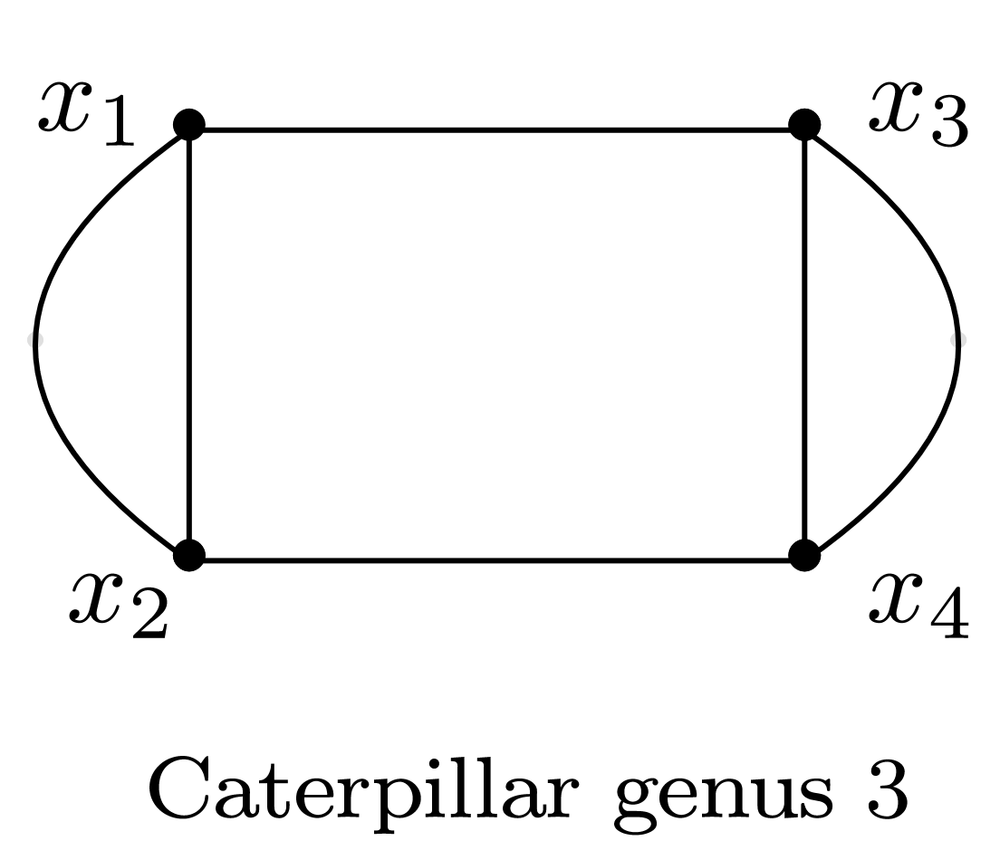

# Quasimodular

In this module, we compute the solution of the system $Ax=b$, where $A$ is a matrix from homogeneous Eisenstein series $E_2, E_4, E_6$ and $b$
from the Feynman Integral $I(q)$
The solution is of the form (factor, coefficients) where coefficients is a vector of rationals numbers.
Given a Feynman Integral

$$I(q)=\sum_{n=1}^{d} a_i q^{d},$$

we compute the coefficients $b_{i,j,k}$ such that

$$I(q)=\sum_{i,j,k} b_{i,j,k} E_2^i E_4^j E_6^k $$

## Example

Consider the Caterpillar 3 graph



```julia
julia> G = graph([(1, 3), (1, 2), (1, 2), (2, 4), (3, 4), (3,4)] )
graph([(1, 3), (1, 2), (1, 2), (2, 4), (3, 4), (3, 4)])
```


We then define a polynomial ring with all variables required by our implementation:

```julia
julia> R, x, q = polynomial_ring(G, "x", "q")
(Multivariate polynomial ring in 10 variables over QQ, QQMPolyRingElem[x[1], x[2], x[3],x[4]], QQMPolyRingElem[q[1], q[2],q[3], q[4], q[5], q[6]])
```


We compute the  sum of all Feynman Integral of degree up to 6.

```julia
julia> Iq=substitute(q,feynman_integral_degree_sum(x,q,G,8))
 886656*q[1]^12 + 182272*q[1]^10 + 25344*q[1]^8 + 1792*q[1]^6 + 32*q[1]^4
```

We express the Feynman Integral Iq in term of Eisenstein series $E_2, E_4, E_6$. 

```julia
julia> quasi_matrix(q,Iq,12)
(1//93312, QQFieldElem[4; 4; -12; -3; 4; 6; -3])
```

The actual homogeneous polynomial is:

```julia
julia> feynman_as_eisensteins(q,Iq,12)
(1//93312, " +4 E6^2 +4 E4^3 -12 E2^1 * E4^1 * E6^1 -3 E2^2 * E4^2 +4 E2^3 * E6^1 +6 E2^4 * E4^1 -3 E2^6")
```
